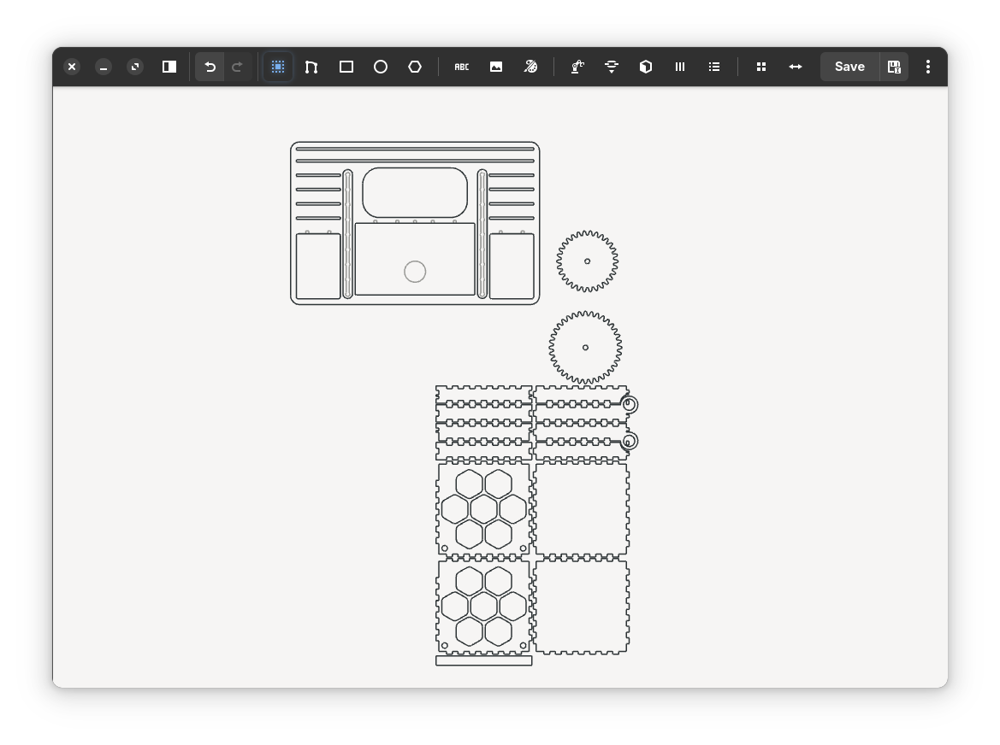

# DXF Sketcher

DXF Sketcher is a focused 2D DXF editor for fast drawing, cleanup, and fabrication prep.

It keeps the parametric sketching core from [dune3d](https://github.com/dune3d/dune3d), but reshapes the workflow around everyday DXF work: open a file or folder, edit directly on canvas, generate helper geometry, and export without a full mechanical CAD workflow getting in the way.

<p align="center">
  
</p>

## What It Does Well

- Open a single `DXF` file or browse a whole folder of drawings
- Draw and edit directly on canvas with lightweight sketch tools
- Keep constraints, dimensions, and precise geometry when needed
- Save back to `DXF` or export through `Save As` to `DXF` or `SVG`
- Generate fabrication-ready geometry inside the app instead of bouncing between separate tools

## Main Features

### Drawing and editing

- Contour drawing
- Rectangle and rounded rectangle tools
- Circles, arcs, and regular polygons
- Text placement
- Direct selection, move, duplicate, and cleanup workflows
- Symmetry tools and layered sketch organization

### Fabrication tools

- Built-in **Boxes** catalog powered by bundled `boxes.py`
- **Edge Tools** for joints, hinges, grooves, lids, flex cuts, handles, and utility edge operations
- Built-in **Gears** generator
- **Cup Template** helper
- **Import Raster** and **Trace Image**

### Workflow polish

- Five built-in theme variants: `Light`, `Mix`, `Dark`, `Light-Blue`, `Blue`
- Accent color selection from the in-app menu
- Consistent themed generator and import windows
- Practical toolbar and popover-driven sketch workflow

## Typical Workflows

### Edit a DXF quickly

1. Open one file or a folder with multiple DXF files.
2. Choose the sketch you want to work on.
3. Draw, trim, move, constrain, trace, or generate helper geometry.
4. Save back to `DXF` or export to `DXF` / `SVG`.

### Prepare fabrication geometry

- Use **Boxes** to generate layouts from real `boxes.py` parameters
- Use **Edge Tools** to apply finger joints, grooves, hinges, slide-on lids, flex cuts, and other edge treatments
- Use **Gears** to build involute gear outlines directly in the sketch
- Use **Import Raster** and **Trace Image** to turn bitmap artwork into editable vector geometry

## Screenshots

<table>
  <tr>
    <td align="center" width="50%">
      <br>
      <strong>Import Raster</strong><br>
      Preprocess a bitmap before tracing or applying it.
    </td>
    <td align="center" width="50%">
      <br>
      <strong>Trace Image</strong><br>
      Convert raster artwork into editable sketch geometry.
    </td>
  </tr>
  <tr>
    <td align="center" width="50%">
      <br>
      <strong>Gears Generator</strong><br>
      Create involute gear geometry inside the app.
    </td>
    <td align="center" width="50%">
      <br>
      <strong>Boxes</strong><br>
      Preview templates, adjust native parameters, and import the result.
    </td>
  </tr>
  <tr>
    <td align="center" width="50%">
      <br>
      <strong>Boxes Catalog</strong><br>
      Browse categories, favorites, and templates.
    </td>
    <td align="center" width="50%">
      <br>
      <strong>Boxes Gallery</strong><br>
      Browse sample photos visually before importing.
    </td>
  </tr>
</table>

## Install

Current stable release: **1.5.0**

Releases are published on GitHub:

- https://github.com/EriArk/-DXF-Sketcher/releases

Current Debian package:

- `dxfsketcher_1.5.0_amd64.deb`

Install on Debian or Ubuntu:

```bash
sudo apt install ./dxfsketcher_1.5.0_amd64.deb
```

## Build From Source

DXF Sketcher is built as the sketcher-only variant of the project:

```bash
meson setup build-sketcher -Dsketcher_only=true
ninja -C build-sketcher dxfsketcher
./build-sketcher/dxfsketcher
```

To build a Debian package locally:

```bash
bash scripts/build_deb.sh build-sketcher
```

## Project Notes

- `DXF` is the main editable document workflow
- `SVG` export is available through `Save As`
- The app is tuned for 2D sketching and fabrication prep, not full 3D solid-model CAD

## Acknowledgements

DXF Sketcher builds on work and ideas from:

- [dune3d](https://github.com/dune3d/dune3d)
- [SolveSpace](https://github.com/solvespace/solvespace)
- [boxes.py](https://boxes.hackerspace-bamberg.de/)
- [dxflib](https://www.ribbonsoft.com/dxflib.html)
- [Clipper2](http://www.angusj.com/clipper2/Docs/Overview.htm)
- [nlohmann/json](https://github.com/nlohmann/json)
- [NanoSVG](https://github.com/memononen/nanosvg)

## License

- DXF Sketcher: **GPL-3.0**
- Third-party components keep their own licenses inside `3rd_party/`
