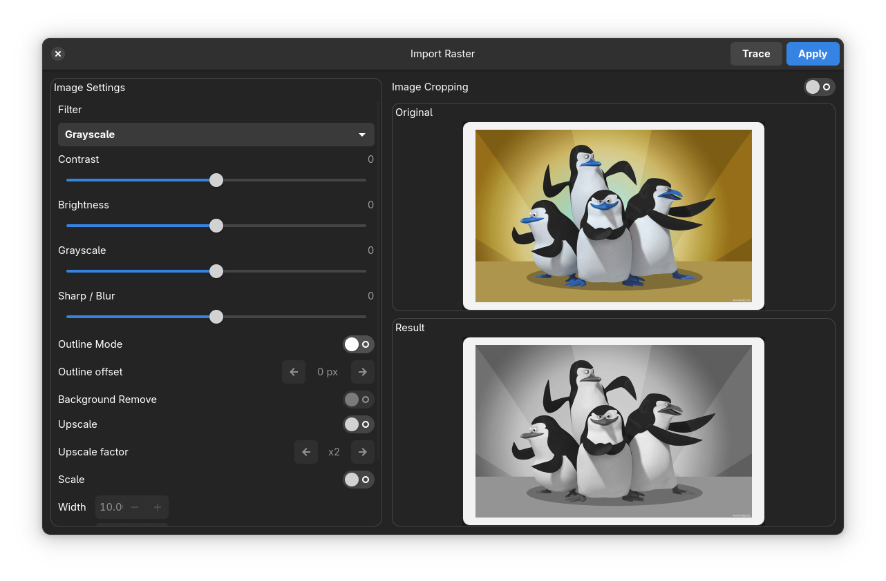
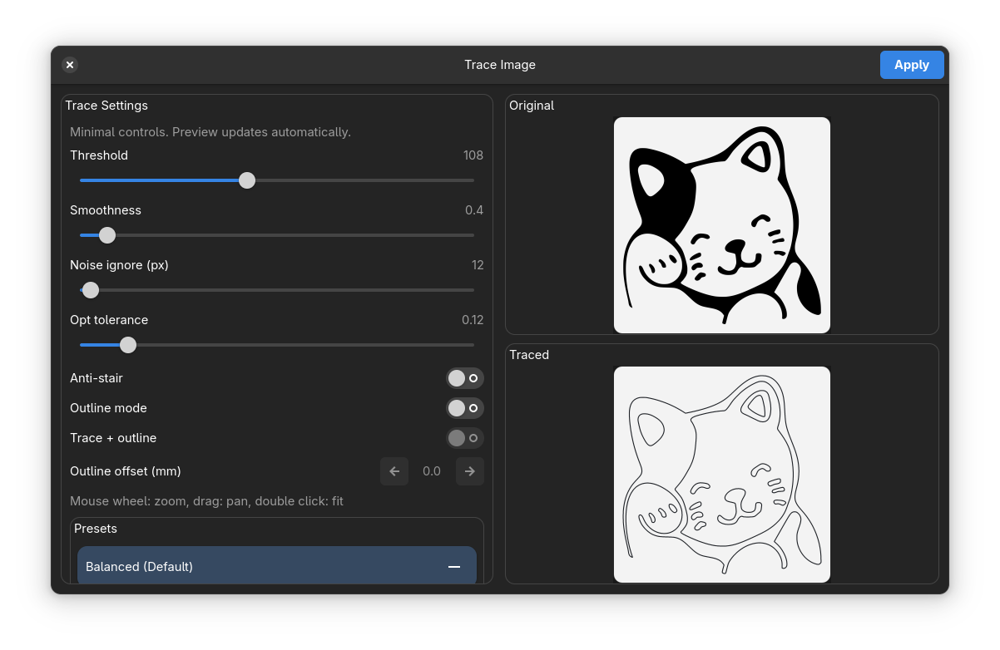
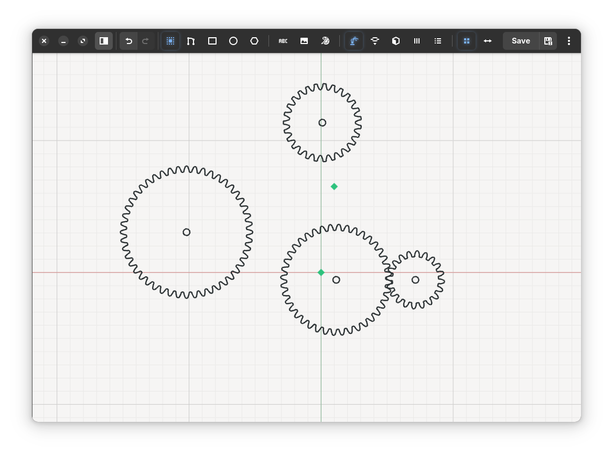
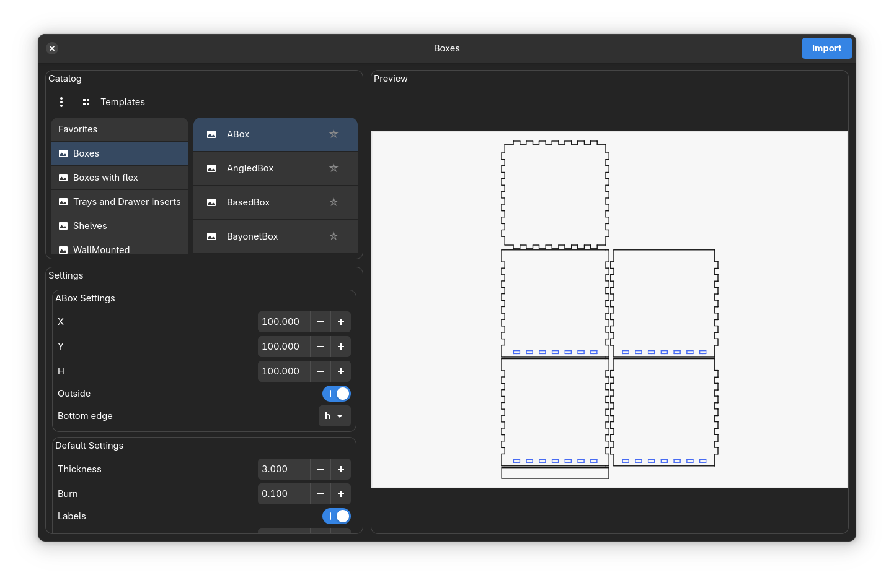
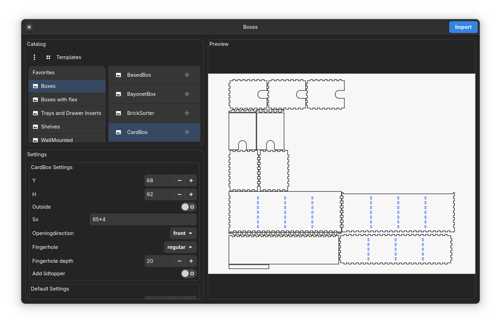
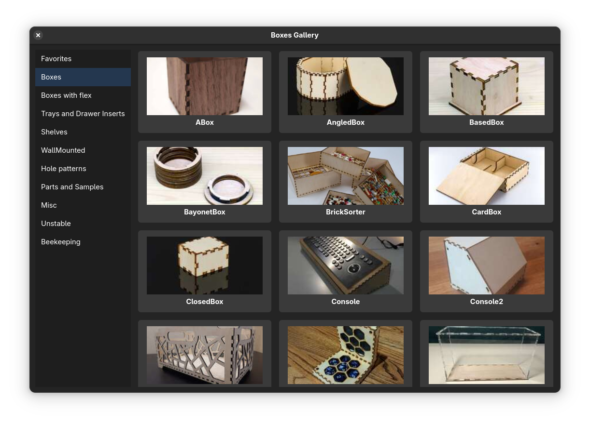
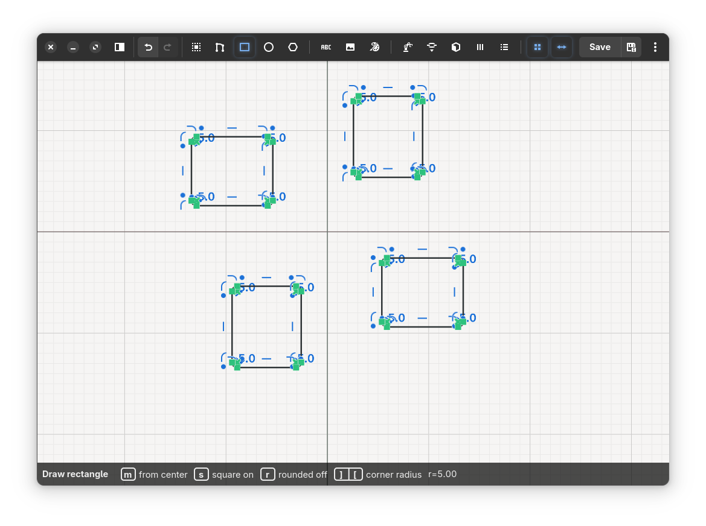
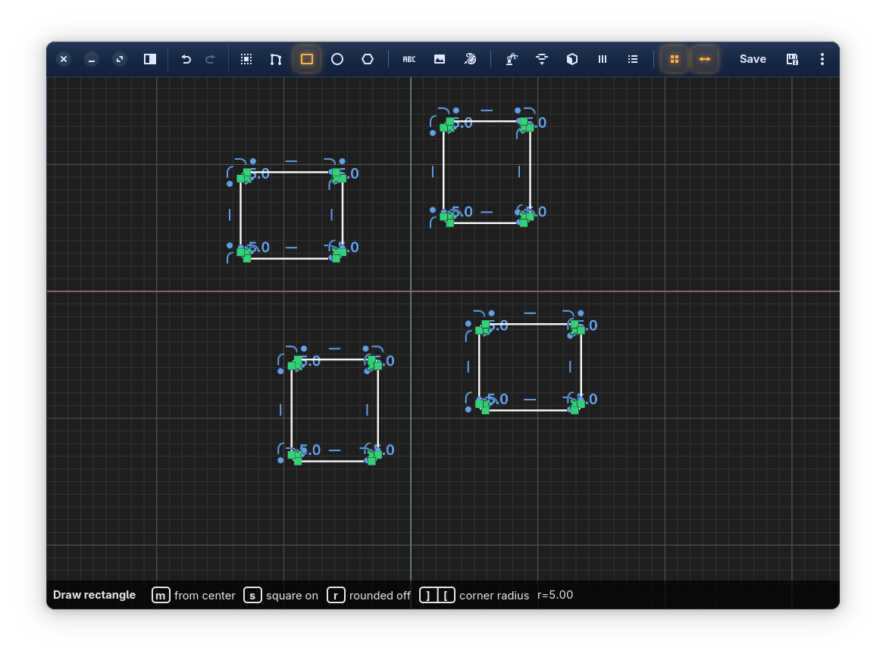
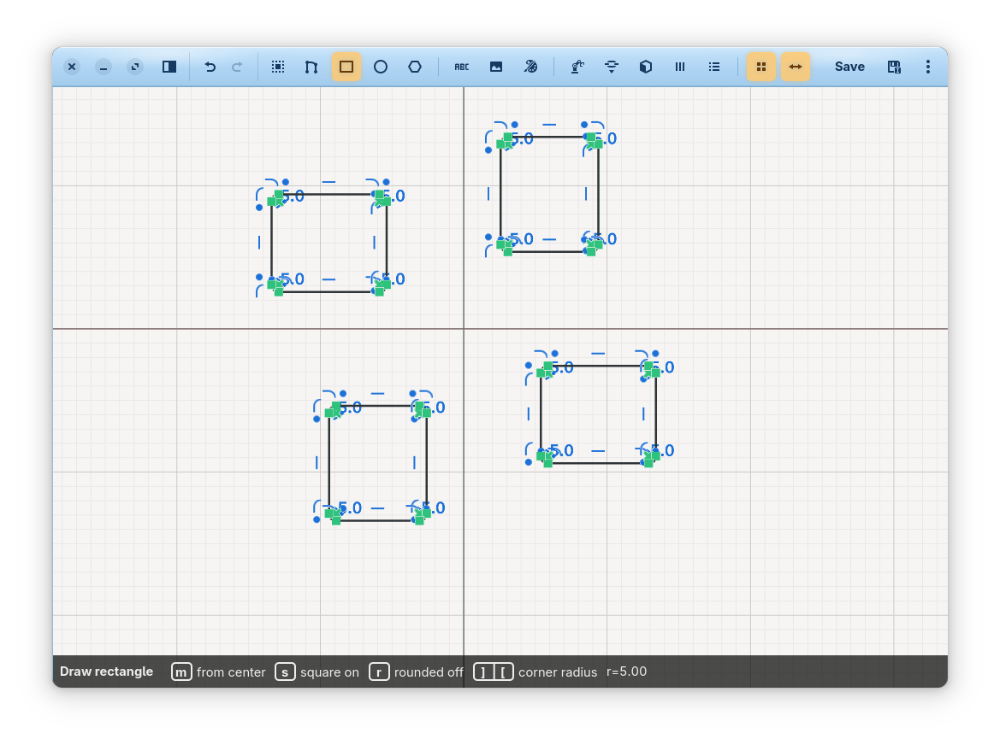

# DXF Sketcher

DXF Sketcher is a practical 2D DXF editor for fast sketching, cleanup, and fabrication prep.

It keeps the parametric core from [dune3d](https://github.com/dune3d/dune3d), but reshapes the workflow around everyday DXF work: faster drawing, faster selection, and built-in helpers for boxes, gears, raster tracing, and edge-based fabrication features.

Repository: <https://github.com/EriArk/-DXF-Sketcher>

<p align="center">
  
</p>

## Why DXF Sketcher

- Open a single DXF or a whole folder of DXF files.
- Edit directly on canvas without the overhead of a full mechanical CAD workflow.
- Keep parametric constraints, dimensions, and precise geometry when you need them.
- Save back to DXF, or export with `Save As` to `DXF` or `SVG`.
- Generate fabrication-ready geometry inside the app instead of bouncing between external tools.

## 1.5.0 Prerelease Highlights

- **Self-contained Boxes integration**: `boxes.py` is bundled with the app, so users no longer need a separate installation.
- **Much larger Boxes workflow**: categories, favorites, gallery view, sample-photo previews, and native template settings.
- **New Edge Features workflow**: family-based operations for joints, hinges, grooves, lids, flex cuts, mounting slots, handles, and related edge treatments.
- **Raster-to-vector flow is now first-class**: import a bitmap, preprocess it, trace it, and apply it directly to the sketch.
- **New gear generator** for common involute gear geometry.
- **Theme and workflow polish** for day-to-day DXF editing.

## Feature Overview

### Drawing and editing

- Contour drawing
- Rectangle and rounded rectangle tools
- Circles, arcs, and regular polygons
- Text placement
- Move, copy/paste, and direct selection workflows
- Open-folder workflow for DXF collections

### Precision and sketch control

- Parametric constraints
- Dimensions and measurements
- Symmetry tools
- Layered sketch organization
- Technical marker and constraint visibility controls

### Fabrication helpers

- Built-in **Boxes** catalog powered by bundled `boxes.py`
- Built-in **Gears** generator
- Built-in **Edge Features** tool
- **Cup Template** helper
- **Import Raster** and **Trace Image**

### Output

- Native `DXF` editing workflow
- `DXF` export through `Save As`
- `SVG` export through `Save As`

## Main Workflows

### Edit DXF quickly

1. Open one file or a full DXF folder.
2. Pick the sketch you want to work on.
3. Draw, move, constrain, mirror, trace, or generate helper geometry.
4. Save back to the original DXF or export to DXF / SVG.

### Prepare fabrication geometry

- Use **Boxes** to generate box layouts with real `boxes.py` parameters.
- Use **Edge Features** to add finger joints, dovetails, grooves, hinges, slide-on lid edges, flex cuts, handles, and utility cuts.
- Use **Gears** to generate involute gear outlines.
- Use **Trace Image** to convert black-and-white or processed raster artwork into editable vector geometry.

## Screenshots

<table>
  <tr>
    <td align="center" width="50%">
      <br>
      <strong>Import Raster</strong><br>
      Preprocess a bitmap before tracing or applying it.
    </td>
    <td align="center" width="50%">
      <br>
      <strong>Trace Image</strong><br>
      Turn raster artwork into editable sketch geometry.
    </td>
  </tr>
  <tr>
    <td align="center" width="50%">
      <br>
      <strong>Gears Generator</strong><br>
      Create involute gear geometry directly inside the sketcher.
    </td>
    <td align="center" width="50%">
      <br>
      <strong>Boxes Preview</strong><br>
      Browse templates and tweak native parameters before import.
    </td>
  </tr>
  <tr>
    <td align="center" width="50%">
      <br>
      <strong>Boxes Catalog</strong><br>
      Category and template browser with favorites.
    </td>
    <td align="center" width="50%">
      <br>
      <strong>Template-Specific Settings</strong><br>
      Use real per-template controls instead of a generic wrapper.
    </td>
  </tr>
  <tr>
    <td align="center" colspan="2">
      <br>
      <strong>Boxes Gallery</strong><br>
      Sample photos for browsing the bundled library visually.
    </td>
  </tr>
</table>

## Theme Variants

<table>
  <tr>
    <td align="center" width="33%">
      <br>
      <strong>Dark</strong>
    </td>
    <td align="center" width="33%">
      <br>
      <strong>Dark Blue</strong>
    </td>
    <td align="center" width="33%">
      <br>
      <strong>Soft Light</strong>
    </td>
  </tr>
</table>

## Install

Prebuilt packages are distributed from GitHub Releases.

For the `1.5.0` prerelease, the published artifact is:

- `dxfsketcher_1.5.0_*.deb`

Install on Debian/Ubuntu-based systems with:

```bash
sudo apt install ./dxfsketcher_1.5.0_amd64.deb
```

### Build from source

```bash
meson setup build-sketcher
ninja -C build-sketcher dxfsketcher
./build-sketcher/dxfsketcher
```

## Current Notes

- `DXF` is the main editable document format.
- `SVG` export is supported with `Save As`.
- Opening standalone `SVG` as the main editable document is still not the primary workflow.
- Some advanced Edge Features families will continue to improve after this prerelease.

## Acknowledgements

DXF Sketcher builds on work and ideas from:

- [dune3d](https://github.com/dune3d/dune3d)
- [SolveSpace](https://github.com/solvespace/solvespace)
- [boxes.py](https://boxes.hackerspace-bamberg.de/)
- [dxflib](https://www.ribbonsoft.com/dxflib.html)
- [Clipper2](http://www.angusj.com/clipper2/Docs/Overview.htm)
- [nlohmann/json](https://github.com/nlohmann/json)
- [NanoSVG](https://github.com/memononen/nanosvg)

## License

- DXF Sketcher: **GPL-3.0**
- Third-party components keep their own licenses inside `3rd_party/`
